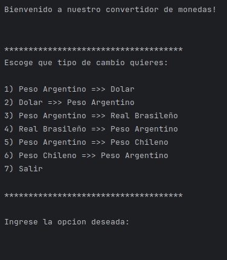
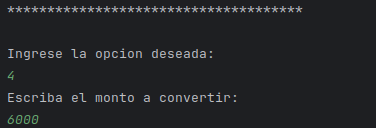
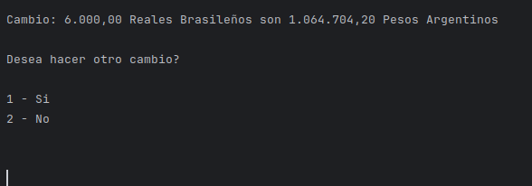
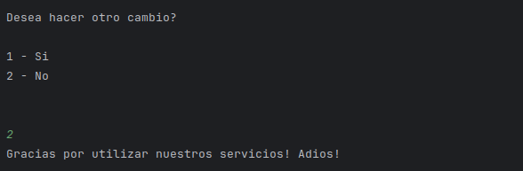
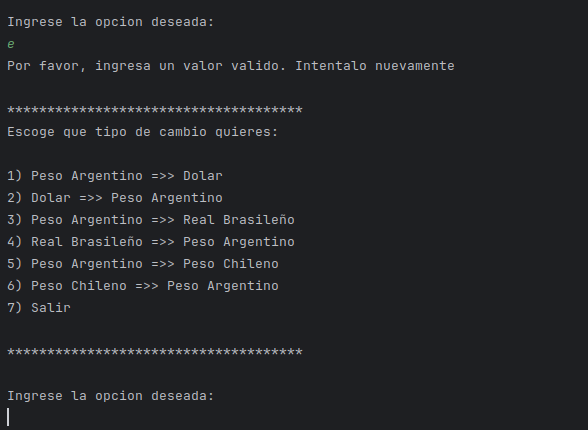

# Conversor de monedas
### Desafio One - Alura Latam

---

    

    

## Descripcion

---
Este es un proyecto desarrollado en el programa One - Alura Latam. 
El objetivo es crear un conversor de monedas, para ello se utilizo la API:

[ExchangeRate-API](https://www.exchangerate-api.com/)

## Funcionalidad

---
#### En nuestra app, luego de darnos la bienvenida, se nos dan las opciones de intercambio: 

#### Luego de ingresar la opcion, nos solicitara que ingresemos el monto:

#### En el caso del ejemplo estamos convirtiendo Reales a Pesos Argentinos.

#### En el siguiente paso, usando la respuesta de la API, se nos da el monto equivalente en la moneda elegida, en este caso Pesos Argentinos.
#### Despues de obtenida la respuesta, tendremos la opcion de hacer otra conversion, o salir del programa.

#### En el caso de elegir que si, el programa vuelve a brindarnos la opcion de elegir el tipo de conversion.
#### En el caso de elegir que no, se cerrara el programa con un saludo de despedida.

## Manejo de errores

---

#### En el caso de ingresar datos con errores, como por ejemplo usar letras para ingresar un monto, el programa nos informara de que tenemos un error y nos dara la opcion de volver a intentarlo.

---

---